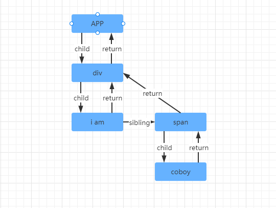

# 为什么 React 的 Diff 算法不采用 Vue 的双端对比算法

### 前言

其实为什么 React 不采用 Vue 的双端对比算法，React 官方已经在源码的注释里已经说明了，我们来看一下 React 官方是怎么说的。

```javascript
function reconcileChildrenArray(
returnFiber: Fiber,
 currentFirstChild: Fiber | null,
 newChildren: Array<*>,
 expirationTime: ExpirationTime,
): Fiber | null {
    // This algorithm can't optimize by searching from boths ends since we
    // don't have backpointers on fibers. I'm trying to see how far we can get
    // with that model. If it ends up not being worth the tradeoffs, we can
    // add it later.

    // Even with a two ended optimization, we'd want to optimize for the case
    // where there are few changes and brute force the comparison instead of
    // going for the Map. It'd like to explore hitting that path first in
    // forward-only mode and only go for the Map once we notice that we need
    // lots of look ahead. This doesn't handle reversal as well as two ended
    // search but that's unusual. Besides, for the two ended optimization to
    // work on Iterables, we'd need to copy the whole set.

    // In this first iteration, we'll just live with hitting the bad case
    // (adding everything to a Map) in for every insert/move.

    // If you change this code, also update reconcileChildrenIterator() which
    // uses the same algorithm.
｝
```

大概的意思就是说：

React 不能通过双端对比进行 diff 算法优化是因为目前 Fiber 上没有设置反向链表，而且想知道就目前这种方案能持续多久，如果目前这种模式不理想的话，那么也可以增加双端对比算法。

即使是双端对比算法，我们也要对这种情况进行优化，我们应该使用 Map 这种数据结构方案去替代原来那种几乎没有什么变化也进行暴力比较的方案。它第一次搜索循环是通过 forward-only 这种模式（就是**只从左向右查找**），（第一次循环可能还没有结束，还有节点没有比对的时候）如果还要继续向前循环查找那么就要通过 Map 这种数据类型了。（就目前这个单向链表的数据结构，如果采用）双端对比查找算法比较难控制它反向查找的，但它确实是一种成功的算法。此外，双端对比算法的实现也在我们的工作迭代当中。

第一次迭代，我们就先将就使用这种不好的方案吧，每次新增/移动都要添加所有的数据到一个 Map 的数据类型对象中。

“we'd need to copy the whole set”，这一句，每一个单词都懂，但就是不知道他想说什么，所以就不翻译了，有知道的大神吗？

**本人水平有限，错漏难免，如有错漏，恳请各位斧正。**

都说“双端对比算法”，那么双端对比算法，到底是怎么样的呢？跟 React 中的 diff 算法又有什么不同呢？

要了解这些，我们先了解 React 中的 diff 算法，然后再了解 Vue3 中的 diff 算法，最后讲一下 Vue2 中的 diff 算法，才能去比较一下他们的区别。

最后讲一下为什么 Vue 中不需要使用 Fiber 架构。


我们首先要了解什么是 Fiber，为什么 React 中要使用 Fiber？


### Fiber 的结构

在 React15 以前 React 的组件更新创建虚拟 DOM 和 diff 的过程是不可中断，如果需要更新组件树层级非常深的话，在 diff 的过程会非常占用浏览器的线程，而我们都知道浏览器执行JavaScript 的线程和渲染真实 DOM 的线程是互斥的，也就是同一时间内，浏览器要么在执行 JavaScript 的代码运算，要么在渲染页面，如果 JavaScript 的代码运行时间过长则会造成页面卡顿。
基于以上原因 React 团队在 React16 之后就改写了整个架构，将原来数组结构的虚拟DOM，改成叫 Fiber 的一种数据结构，基于这种 Fiber 的数据结构可以实现由原来不可中断的更新过程变成异步的可中断的更新。

Fiber 的数据结构主要长成以下的样子，主要通过 Fiber 的一些属性去保存组件相关的信息。 

```javascript
function FiberNode(
  tag: WorkTag,
  pendingProps: mixed,
  key: null | string,
  mode: TypeOfMode,
) {
  // 作为静态数据结构的属性
  this.tag = tag;
  this.key = key;
  this.elementType = null;
  this.type = null;
  this.stateNode = null;

  // 用于连接其他Fiber节点形成Fiber树
  this.return = null;
  this.child = null;
  this.sibling = null;
  this.index = 0;

  this.ref = null;

  // 作为动态的工作单元的属性
  this.pendingProps = pendingProps;
  this.memoizedProps = null;
  this.updateQueue = null;
  this.memoizedState = null;
  this.dependencies = null;

  this.mode = mode;

  this.effectTag = NoEffect;
  this.nextEffect = null;

  this.firstEffect = null;
  this.lastEffect = null;

  // 调度优先级相关
  this.lanes = NoLanes;
  this.childLanes = NoLanes;

  // 指向该fiber在另一次更新时对应的fiber
  this.alternate = null;
}
```

Fiber 主要靠以下属性连成一棵树结构的数据的，也就是 Fiber 链表。

```javascript
// 指向父级Fiber节点
this.return = null;
// 指向子Fiber节点
this.child = null;
// 指向右边第一个兄弟Fiber节点
this.sibling = null;
```

举个例子，如下的组件结构： 

```javascript
function App() {
  return (
    <div>
      i am
      <span>Coboy</span>
    </div>
  )
}
```

对应的 Fiber 链表结构： 

 

那么以上的 Fiber 链表的数据结构有什么特点，就是任何一个位置的 Fiber 节点，都可以非常容易知道它的父 Fiber, 第一个子元素的 Fiber,和它的兄弟节点 Fiber。却不容易知道它前一个 Fiber 节点是谁，这就是 React 中单向链表 Fiber 节点的特点。

那么 React 是将对应组件怎么生成一个 Fiber 链表数据的呢？


### Fiber 链表的生成

上面的组件在经过 JSX 的编译之后，会变成一个类似于 React 15 或者 Vue 那种虚拟 DOM 的数据结构。然后创建一个叫 fiberRoot 的 Fiber 节点，然后开始从 fiberRoot 这个根 Fiber 开始启动，生成一棵 Fiber 树，这个棵树被称为：`workInProgress Fiber树` ，接下来我们详细了解一下具体是怎么生成一棵 Fiber 树的。要先了解 Fiber 书的生成原理才更好去理解 Fiber 树 diff 的过程。

```javascript
export function reconcileChildren(returnFiber, children) {
    // 如果是字符串或者数字则不创建 Fiber
    if(isStringOrNumber(children)) {
        return
    }
    const newChildren = isArray(children) ? children : [children]
    // 上一轮的 fiber 节点
    let previousNewFiber = null;
    // 初次渲染（false）还是更新（true）
    let shouldTrackSideEffects = !!returnFiber.alternate
    // 老 Fiber 节点
    let oldFiber = returnFiber.alternate && returnFiber.alternate.child
    let nextOldFiber = null
    // 上一次协调返回的位置
    let lastPlacedIndex = 0;
    // 记录每个 fiber 节点的位置
    let newIdx = 0;
    // 如果不存在老 Fiber 则是初始化的过程，进行 Fiber 链表的创建
    if(!oldFiber) {
        for (; newIdx < newChildren.length; newIdx++) {
            // 获取
            const newChild = newChildren[newIdx]
            // 如果节点为 null 则不需要创建 fiber 节点
            if(newChild === null) {
                continue
            }
            const newFiber = createFiber(newChild, returnFiber)
            // 记录当前的位置
            lastPlacedIndex = placeChild(
                newFiber,
                lastPlacedIndex,
                newIdx,
                shouldTrackSideEffects // 初次渲染（false）还是更新（true）
            )
		    // 当上一轮的 fiber 节点为 null 的时候，这一轮的 fiber 就是头节点
            if(previousNewFiber === null) {
                // 父 fiber 的 child 就是第一个节点
                returnFiber.child = newFiber
            } else {
                // 如果不是第一个节点，那么就是兄弟节点
                // 上一轮 fiber 的兄弟节点是这一轮的 fiber 节点
                previousNewFiber.sibling = newFiber;
            }
		   // 记录上一轮的 fiber
            previousNewFiber = newFiber
        }
        return
    }
}
```

构建完的 `workInProgress Fiber树` 会在 `commit阶段` 渲染到页面。

在组件状态数据发生变更的时候，会根据最新的状态数据先会生成新的虚拟DOM，再去构建一棵新的 `workInProgress Fiber 树`  ，而在重新协调构建新的 Fiber 树的过程也就是 React diff 发生的地方。接下来，我们就看看 React Diff 算法是怎么样的。

### React 的 diff 算法

深度优先，有子节点，就遍历子节点，没有子节点，就找兄弟节点，没有兄弟节点，就找叔叔节点，叔叔节点也没有的话，就继续往上找，它爷爷的兄弟，如果一直没找到，就代表所有的更新任务都更新完毕了。

更新自己，然后去协调子节点，也就是进行 diff 的地方。

进入协调的时候它自己就是父 Fiber，它的子节点在协调之前，是刚刚通过更新的状态数据生成的最新的虚拟DOM数据，是个数组结构的数据。

那么要进行更新，就肯定是以为最新的节点数据为准了，又因为最新的节点数据是一个数组，所以可以进行循环对比每一个节点，很明显这个循环是**从左向右进行查找比对**的。

那么第一个节点的老 Fiber 怎么拿到呢？可以通过 父 Fiber 的 child 属性拿到，这样第一个节点的老 Fiber 就拿到了，那么第二节点的老 Fiber，很明显可以通过第一个节点的老 Fiber 节点的 sibling 属性拿到，后面的以此类推。

怎么比对呢？

在循环的新节点虚拟DOM数据的时候，拿到新节点虚拟DOM信息，然后就去和老 Fiber 节点进行比对，如果两个节点相同则创建一个新的 Fiber 节点并复用一些老 Fiber 节点的信息，比如真实 DOM，并给这个新的 Fiber 节点打上一个 Update 的 flags，代表这个节点需要更新即可。

接着去更新协调位置信息。

### Vue3 的 diff 算法


### Vue2 的 diff 算法


### 为什么 Vue 中不需要使用 Fiber


