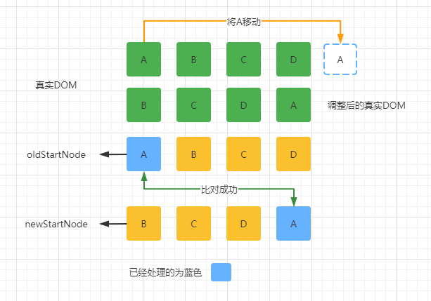
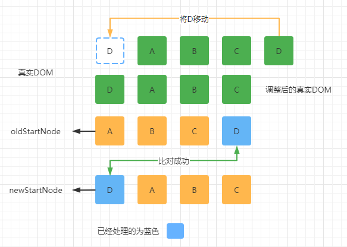

# 为什么 React 的 Diff 算法不采用 Vue 的双端对比算法

### 前言

其实为什么 React 不采用 Vue 的双端对比算法，React 官方已经在源码的注释里已经说明了，我们来看一下 React 官方是怎么说的。

```javascript
function reconcileChildrenArray(
returnFiber: Fiber,
 currentFirstChild: Fiber | null,
 newChildren: Array<*>,
 expirationTime: ExpirationTime,
): Fiber | null {
    // This algorithm can't optimize by searching from boths ends since we
    // don't have backpointers on fibers. I'm trying to see how far we can get
    // with that model. If it ends up not being worth the tradeoffs, we can
    // add it later.

    // Even with a two ended optimization, we'd want to optimize for the case
    // where there are few changes and brute force the comparison instead of
    // going for the Map. It'd like to explore hitting that path first in
    // forward-only mode and only go for the Map once we notice that we need
    // lots of look ahead. This doesn't handle reversal as well as two ended
    // search but that's unusual. Besides, for the two ended optimization to
    // work on Iterables, we'd need to copy the whole set.

    // In this first iteration, we'll just live with hitting the bad case
    // (adding everything to a Map) in for every insert/move.

    // If you change this code, also update reconcileChildrenIterator() which
    // uses the same algorithm.
｝
```

大概的意思就是说：

React 不能通过双端对比进行 diff 算法优化是因为目前 Fiber 上没有设置反向链表，而且想知道就目前这种方案能持续多久，如果目前这种模式不理想的话，那么也可以增加双端对比算法。

即使是双端对比算法，我们也要对这种情况进行优化，我们应该使用 Map 这种数据结构方案去替代原来那种几乎没有什么变化也进行暴力比较的方案。它第一次搜索循环是通过 forward-only 这种模式（就是从左向右查找），（第一次循环可能还没有结束，还有节点没有比对的时候）如果还要继续向前循环查找那么就要通过 Map 这种数据类型了。（就目前这个单向链表的数据结构，如果采用）双端对比查找算法比较难控制它反向查找的，但它确实是一种成功的算法。此外，双端对比算法的实现也在我们的工作迭代当中。

第一次迭代，我们就先将就使用这种不好的方案吧，每次新增/移动都要添加所有的数据到一个 Map 的数据类型对象中。

“we'd need to copy the whole set”，这一句，每一个单词都懂，但就是不知道他想说什么，所以就不翻译了，有知道的大神吗？

**本人水平有限，错漏难免，恳请各位大神斧正。**

都说“双端对比算法”，那么双端对比算法，到底是怎么样的呢？

我们先来讲 React 中的 diff 算法，然后再讲 Vue3 中的 diff 算法，最后讲一下 Vue2 中的 diff 算法。

### Reat 的 diff 算法


### Vue3 的 diff 算法


### Vue2 的 diff 算法

先更新处理新老节点的属性（Vue2在更新元素属性的时候，是暴力全量 diff 更新的，Vue3 则做了很多优化。），获取新老节点的子节点，然后进行以下规则的判断。

具体规则如下：

1. 如果新节点有子节点而老节点没有子节点，则判断老节点是否有文本内容，如果有就清空老节点的文本内容，然后为其新增子节点。
2. 如果新节点没有子节点而老节点有子节点，则先删除老节点的子节点，然后设置文本内容。
3. 如果新节点没有子节点，老节点也没有子节点，则进行文本的比对，然后设置文本内容。
4. 如果新节点有子节点，老节点也有子节点，则进行新老节点的比对，然后进行新增、移动、删除的操作，**这也就是传说中的 diff 算法发生的地方**。

```javascript
  // diff 的过程
  // 分析当前两个节点的类型
  // 如果是元素，更新双方属性、特性等，同时比较双方子元素，这个递归过程，叫深度优先
  // 如果双方是文本，更新文本
  function patchVnode (
    oldVnode,
    vnode,
    insertedVnodeQueue,
    ownerArray,
    index,
    removeOnly
  ) {
    if (oldVnode === vnode) {
      return
    }
    // 获取双方孩子
    const oldCh = oldVnode.children
    const ch = vnode.children
    // 比较双方属性
    // Vue2在更新元素属性的时候，是暴力全量 diff 更新的。Vue3 则做了很多优化。
    if (isDef(data) && isPatchable(vnode)) {
      for (i = 0; i < cbs.update.length; ++i) cbs.update[i](oldVnode, vnode)
      if (isDef(i = data.hook) && isDef(i = i.update)) i(oldVnode, vnode)
    }
    // 根据双方类型的几种情况分别处理
    if (isUndef(vnode.text)) {// 新节点没有文本
      if (isDef(oldCh) && isDef(ch)) {
        // 双方都有子元素,就进行重排，传说中的 diff 就发生在这里
        if (oldCh !== ch) updateChildren(elm, oldCh, ch, insertedVnodeQueue, removeOnly)
      } else if (isDef(ch)) {
        // 新节点有孩子, 老的没有，新增创建
        if (process.env.NODE_ENV !== 'production') {
          checkDuplicateKeys(ch)
        }
        // 判断老节点是否有文本内容，如果有则先清空
        if (isDef(oldVnode.text)) nodeOps.setTextContent(elm, '')
        // 批量添加子节点
        addVnodes(elm, null, ch, 0, ch.length - 1, insertedVnodeQueue)
      } else if (isDef(oldCh)) {
        // 新节点没有孩子，老的有的，则删除老节点的孩子节点
        removeVnodes(oldCh, 0, oldCh.length - 1)
      } else if (isDef(oldVnode.text)) {
        // 新节点没有文本节点，老的有文本节点，则清空老的文本节点
        nodeOps.setTextContent(elm, '')
      }
    } else if (oldVnode.text !== vnode.text) {
      // 新老节点都是文本节点，则判断新老文本内容是否相同进行文本更新
      nodeOps.setTextContent(elm, vnode.text)
    }
    // 钩子处理
    if (isDef(data)) {
      if (isDef(i = data.hook) && isDef(i = i.postpatch)) i(oldVnode, vnode)
    }
  }
```

接下来，我们看看两组子元素都是多节点比对的情况，也就是传说 diff 发生的地方。

 

在新老两组VNode节点的左右头尾两侧都有一个变量标记，在遍历过程中这几个变量都会向中间靠拢，当oldStartIdx > oldEndIdx或者newStartIdx > newEndIdx时结束循环。 

先进行以下几种情况的 diff：

1. 老数组的开始与新数组的开始：oldStartVnode, newStartVnode
2. 老数组的结尾与新数组的结尾：oldEndVnode, newEndVnode
3. 老数组的开始与新数组的结尾：oldStartVnode, newEndVnode
4. 老数组的结尾与新数组的开始：oldEndVnode, newStartVnode 
5. 如果以上4种情况都没找到，则从新数组的第一个节点去老数组中去查找，找到了就进行递归更新，没找到则创建新节点

#### 老数组的开始与新数组的开始

 

从左往右比对完，老数组的游标先相交了，发现新数组结尾还有节点没有比对，则在新数组结尾创建剩下没有比对的节点。

 

从左往右比对完，新数组的游标先相交了，发现老数组结尾还有节点没有比对，则删除老数组剩下没有比对的节点。

#### 老数组的结尾与新数组的结尾

 

从右往左比对完，老数组的游标先相交了，发现新数组开头还有节点没有比对，则在新数组开头创建没有比对的节点。

 

从右往左比对完，新数组的游标先相交了，发现老数组的开头还有节点没有比对，则删除老数组开头没有比对的节点。

#### 老数组的开始与新数组的结尾

 

如果老数组的开头节点与新数组的结尾节点比对成功了，除了会继续递归比对它们，还将真实节点 A 移动到结尾。

#### 老数组的结尾与新数组的开始

 

如果老数组的结尾节点与新数组的开始节点比对成功了，除了会继续递归比对它们，还将真实节点D移动到开头。