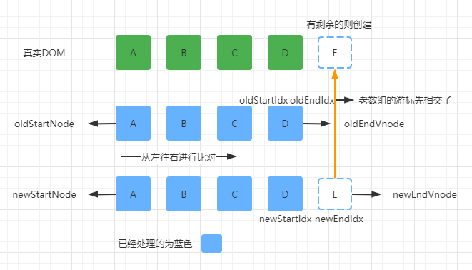
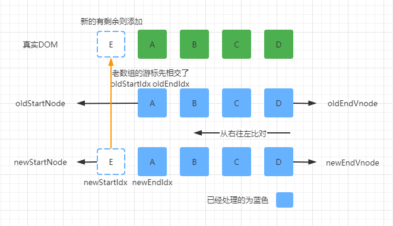
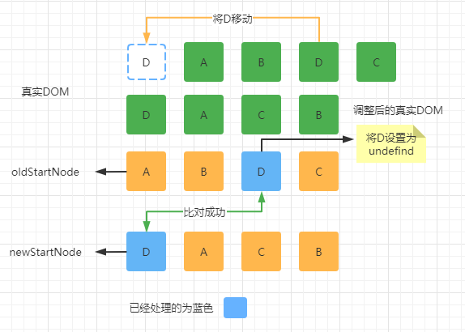
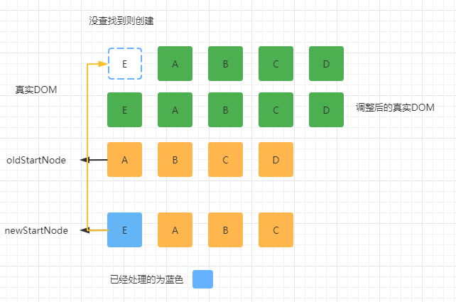

# Vue2 的 diff 算法详解
所谓 diff 算法，就是通过比对新旧两个虚拟节点不一样的地方，针对那些不一样的地方进行更新。接下来我们详细介绍节点更新的过程。

首先进行静态节点处理，判断新旧两个虚拟节点是否是静态节点，如果是，就不需要进行更新操作，可以直接跳过更新比对的过程 。

再更新处理新老节点的属性，获取新老节点的子节点，然后进行一定规则的判断。

这里值得多说一下的是，Vue2 在更新元素属性的时候，是暴力全量 diff 更新的，Vue3 则做了很多优化。

### 算法规则

具体规则如下：

1. 如果新节点有子节点而老节点没有子节点，则判断老节点是否有文本内容，如果有就清空老节点的文本内容，然后为其新增子节点。
2. 如果新节点没有子节点而老节点有子节点，则先删除老节点的子节点，然后设置文本内容。
3. 如果新节点没有子节点，老节点也没有子节点，则进行文本的比对，然后设置文本内容。
4. 如果新节点有子节点，老节点也有子节点，则进行新老子节点的比对，然后进行新增、移动、删除的操作，**这也就是传说中的 diff 算法发生的地方**。

patchVnode 源码解析：

```javascript
  // diff 的过程
  // 分析当前两个节点的类型
  // 如果是元素，更新双方属性、特性等，同时比较双方子元素，这个递归过程，叫深度优先
  // 如果双方是文本，更新文本
  function patchVnode (
    oldVnode,
    vnode,
    insertedVnodeQueue,
    ownerArray,
    index,
    removeOnly
  ) {
    if (oldVnode === vnode) {
      return
    }
    // 静态节点处理
    // 判断新旧两个虚拟节点是否是静态节点，如果是，就不需要进行更新操作，可以直接跳过更新比对的过程
    if (isTrue(vnode.isStatic) &&
      isTrue(oldVnode.isStatic) &&
      vnode.key === oldVnode.key &&
      (isTrue(vnode.isCloned) || isTrue(vnode.isOnce))
    ) {
      vnode.componentInstance = oldVnode.componentInstance
      return
    }
    
    // 获取双方孩子
    const oldCh = oldVnode.children
    const ch = vnode.children
    // 比较双方属性
    // Vue2在更新元素属性的时候，是暴力全量 diff 更新的。Vue3 则做了很多优化。
    if (isDef(data) && isPatchable(vnode)) {
      for (i = 0; i < cbs.update.length; ++i) cbs.update[i](oldVnode, vnode)
      if (isDef(i = data.hook) && isDef(i = i.update)) i(oldVnode, vnode)
    }
    // 根据双方类型的几种情况分别处理
    if (isUndef(vnode.text)) {// 新节点没有文本
      if (isDef(oldCh) && isDef(ch)) {
        // 双方都有子元素,就进行重排，传说中的 diff 就发生在这里
        if (oldCh !== ch) updateChildren(elm, oldCh, ch, insertedVnodeQueue, removeOnly)
      } else if (isDef(ch)) {
        // 新节点有孩子, 老的没有，新增创建
        if (process.env.NODE_ENV !== 'production') {
          checkDuplicateKeys(ch)
        }
        // 判断老节点是否有文本内容，如果有则先清空
        if (isDef(oldVnode.text)) nodeOps.setTextContent(elm, '')
        // 批量添加子节点
        addVnodes(elm, null, ch, 0, ch.length - 1, insertedVnodeQueue)
      } else if (isDef(oldCh)) {
        // 新节点没有孩子，老的有的，则删除老节点的孩子节点
        removeVnodes(oldCh, 0, oldCh.length - 1)
      } else if (isDef(oldVnode.text)) {
        // 新节点没有文本节点，老的有文本节点，则清空老的文本节点
        nodeOps.setTextContent(elm, '')
      }
    } else if (oldVnode.text !== vnode.text) {
      // 新老节点都是文本节点，则判断新老文本内容是否相同进行文本更新
      nodeOps.setTextContent(elm, vnode.text)
    }
    // 钩子处理
    if (isDef(data)) {
      if (isDef(i = data.hook) && isDef(i = i.postpatch)) i(oldVnode, vnode)
    }
  }
```

接下来，我们看看两组子元素都是多节点比对的情况，也就是传说 diff 发生的地方。

 

在新老两组VNode节点的左右头尾两侧都有一个变量标记，在遍历过程中这几个变量都会向中间靠拢，当oldStartIdx > oldEndIdx或者newStartIdx > newEndIdx时结束循环。 

### diff 优化策略

先进行以下4种情况的优化策略：

1. 老数组的开始与新数组的开始：oldStartVnode, newStartVnode
2. 老数组的结尾与新数组的结尾：oldEndVnode, newEndVnode
3. 老数组的开始与新数组的结尾：oldStartVnode, newEndVnode
4. 老数组的结尾与新数组的开始：oldEndVnode, newStartVnode 

如果以上4种情况都没找到，则从新数组的第一个节点去老数组中去查找，找到了就进行递归更新，没找到则创建新节点。

### 老数组的开始与新数组的开始

**新数组的结尾节点有剩余则添加**

 

从左往右比对完，老数组的游标先相交了，发现新数组结尾还有节点没有比对，则在新数组结尾创建剩下没有比对的节点。

**老数组的结尾节点有剩余则删除**

 

从左往右比对完，新数组的游标先相交了，发现老数组结尾还有节点没有比对，则删除老数组剩下没有比对的节点。

### 老数组的结尾与新数组的结尾

**新数组的开头节点有剩余则添加**

 

从右往左比对完，老数组的游标先相交了，发现新数组开头还有节点没有比对，则在新数组开头创建没有比对的节点。

**老数组的开头节点有剩余则删除**

 

从右往左比对完，新数组的游标先相交了，发现老数组的开头还有节点没有比对，则删除老数组开头没有比对的节点。

### 老数组的开始与新数组的结尾

 

如果老数组的开头节点与新数组的结尾节点比对成功了，除了会继续递归比对它们，还将真实节点 A 移动到结尾。

### 老数组的结尾与新数组的开始

 

如果老数组的结尾节点与新数组的开始节点比对成功了，除了会继续递归比对它们，还将真实节点D移动到开头。

### 以上四种情况都没对比成功

如果以上4种情况都没找到，则拿新数组的第一个节点去老数组中去查找。

 

如果拿新数组的第一个节点去老数组中查找成功了，则会继续递归比对它们，同时将比对到的节点移动到对应的节点前面，并且将老数组原来的位置内容设置为 undefind。

 

如果拿新数组的第一个节点去老数组中查找，没找到，则创建一个新的节点**插入到未处理的节点前面**。

### 推荐在渲染列表时为节点设置 key 

如果我们在模版渲染列表时，为节点设置了属性 key，那么在上面建立的 key 与 index 索引的对应关系时，就生成了一个 key 对应着一个节点下标这样一个对象。 也就是说，如果在节点上设置了属性 key，那么在老的虚拟DOM中找相同节点时，可以直接通过 key 拿到下标，从而获取节点，否则我们就需要每一次都要进行遍历查找。 所以非常推荐在渲染列表时为节点设置 key，最好是后端返回的唯一 ID。 

### 循环比对结束的后续处理工作

如果老数组的游标先相交了，则判断新数组中是否还有剩下的节点，没有进行比对的，创建它们。

如果新数组的游标先相交了，则判断老数组中是否还有剩下的节点，没有进行比对的，把它们都删除掉。

### 源码解析

```javascript
// 传说中的 diff 发生的地方
  function updateChildren (parentElm, oldCh, newCh, insertedVnodeQueue, removeOnly) {
    // 4个游标和对应节点
    let oldStartIdx = 0
    let newStartIdx = 0
    let oldEndIdx = oldCh.length - 1
    let oldStartVnode = oldCh[0]
    let oldEndVnode = oldCh[oldEndIdx]
    let newEndIdx = newCh.length - 1
    let newStartVnode = newCh[0]
    let newEndVnode = newCh[newEndIdx]
    // 后续查找需要的变量
    let oldKeyToIdx, idxInOld, vnodeToMove, refElm
    
    const canMove = !removeOnly

    // 循环条件是游标不能交叉，交叉就结束
    while (oldStartIdx <= oldEndIdx && newStartIdx <= newEndIdx) {
      // 前两个是校正，在之前的比对中可能会删除其中的旧节点，之后就会往前或者往后移动一位
      if (isUndef(oldStartVnode)) {
        oldStartVnode = oldCh[++oldStartIdx] // Vnode has been moved left
      } else if (isUndef(oldEndVnode)) {
        oldEndVnode = oldCh[--oldEndIdx]
      } else if (sameVnode(oldStartVnode, newStartVnode)) {
        // 先查找两个开头节点
        patchVnode(oldStartVnode, newStartVnode, insertedVnodeQueue, newCh, newStartIdx)
        oldStartVnode = oldCh[++oldStartIdx]
        newStartVnode = newCh[++newStartIdx]
      } else if (sameVnode(oldEndVnode, newEndVnode)) {
        // 两个结尾节点
        patchVnode(oldEndVnode, newEndVnode, insertedVnodeQueue, newCh, newEndIdx)
        oldEndVnode = oldCh[--oldEndIdx]
        newEndVnode = newCh[--newEndIdx]
      } else if (sameVnode(oldStartVnode, newEndVnode)) { // Vnode moved right
        // 老的开始节点，新的结尾节点
        patchVnode(oldStartVnode, newEndVnode, insertedVnodeQueue, newCh, newEndIdx)
        // 进行节点移动
        // node.insertBefore(newnode,existingnode) 1.newnode 必需。需要插入的节点对象  2.existingnode 可选。在其之前插入新节点的子节点。如果未规定，则 insertBefore 方法会在结尾插入 newnode。
        canMove && nodeOps.insertBefore(parentElm, oldStartVnode.elm, nodeOps.nextSibling(oldEndVnode.elm))
        oldStartVnode = oldCh[++oldStartIdx]
        newEndVnode = newCh[--newEndIdx]
      } else if (sameVnode(oldEndVnode, newStartVnode)) { // Vnode moved left
        // 老的结尾节点，新的开始节点
        patchVnode(oldEndVnode, newStartVnode, insertedVnodeQueue, newCh, newStartIdx)
        // 进行节点移动
        canMove && nodeOps.insertBefore(parentElm, oldEndVnode.elm, oldStartVnode.elm)
        oldEndVnode = oldCh[--oldEndIdx]
        newStartVnode = newCh[++newStartIdx]
      } else {
        // 首尾没找到
        // 第一次创建一个老的节点的索引 Map，方便后续不需要遍历查找，这是一个空间换时间的方法
        if (isUndef(oldKeyToIdx)) oldKeyToIdx = createKeyToOldIdx(oldCh, oldStartIdx, oldEndIdx)
        // 拿新虚拟DOM开头的第一个节点，去老的虚拟DOM中进行查找
        // 如果我们在模版渲染列表时，为节点设置了属性 key，那么在上面建立的 key 与 index 索引的对应关系时，就生成了一个 key 对应着一个节点下标这样一个对象。
        // 也就是说，如果在节点上设置了属性 key，那么在老的虚拟DOM中找相同节点时，可以直接通过 key 拿到下标，从而获取节点，否则我们就需要每一次都要进行遍历查找。
        // 所以非常推荐在渲染列表时为节点设置 key，最好是后端返回的唯一 ID。
        idxInOld = isDef(newStartVnode.key)
          ? oldKeyToIdx[newStartVnode.key]
          : findIdxInOld(newStartVnode, oldCh, oldStartIdx, oldEndIdx)
        if (isUndef(idxInOld)) { // New element
          // 没找到就进行创建，并且插入到未处理的节点（oldStartVnode.elm）的前面
          createElm(newStartVnode, insertedVnodeQueue, parentElm, oldStartVnode.elm, false, newCh, newStartIdx)
        } else {
          vnodeToMove = oldCh[idxInOld]
          // 找到之后，也要进行判断是否相同节点
          if (sameVnode(vnodeToMove, newStartVnode)) {
            // 递归更新
            patchVnode(vnodeToMove, newStartVnode, insertedVnodeQueue, newCh, newStartIdx)
            oldCh[idxInOld] = undefined
            canMove && nodeOps.insertBefore(parentElm, vnodeToMove.elm, oldStartVnode.elm)
          } else {
            // same key but different element. treat as new element
            // 创建新的节点进行替换
            createElm(newStartVnode, insertedVnodeQueue, parentElm, oldStartVnode.elm, false, newCh, newStartIdx)
          }
        }
        newStartVnode = newCh[++newStartIdx]
      }
    }
    // 循环结束
    // 后续处理工作
    if (oldStartIdx > oldEndIdx) {
      // 老的先结束，判断新的虚拟DOM中是否还有剩下的节点，批量创建
      refElm = isUndef(newCh[newEndIdx + 1]) ? null : newCh[newEndIdx + 1].elm
      addVnodes(parentElm, refElm, newCh, newStartIdx, newEndIdx, insertedVnodeQueue)
    } else if (newStartIdx > newEndIdx) {
      // 新的先结束，判断老的虚拟DOM中是否还剩下，批量删除
      removeVnodes(oldCh, oldStartIdx, oldEndIdx)
    }
  }
```


### 总结

总的来说 Vue2 的 diff 算法就是以新的虚拟DOM为准进行与老虚拟DOM的比对，继而进行各种情况的处理。大概可以分为 4 种情况：更新节点、新增节点、删除节点、移动节点位置。比对新老两个虚拟DOM，就是通过循环，每循环到一个新节点，就去老节点列表里面找到和当前新节点相同的旧节点。如果在旧节点列表中找不到，说明当前节点是需要新增的节点，我们就需要进行创建节点并插入视图的操作；如果找到了，就做更新操作；如果找到的旧节点与新节点位置不同，则需要移动节点等。

其中为了快速查找到节点，Vue2 的 diff 算法设置了 4 种优化策略，分别是：

1. 老数组的开始与新数组的开始
2. 老数组的结尾与新数组的结尾
3. 老数组的开始与新数组的结尾
4. 老数组的结尾与新数组的开始

通过这 4 种快捷的查找方式，我们就不需要循环来查找了，只有当以上 4 种方式都查找不到的时候，再进行循环查找。

最后循环结束后需要对未处理的节点进行处理。

如果是老节点列表先循环完毕，这个时候如果新节点列表还有剩余的节点，则说明这些节点都是需要新增的节点，直接把这些节点创建并插入到 DOM 中就行了。

如果是新节点列表先循环完毕，这个时候如果老节点列表还有剩余节点，则说明这些节点都是要被废弃的节点，是应该被删除的节点，直接批量删除就可以了。

以上就是 Vue2 的 diff 算法了。限于本人水平有限，错漏难免，如有错漏，恳请各位斧正。